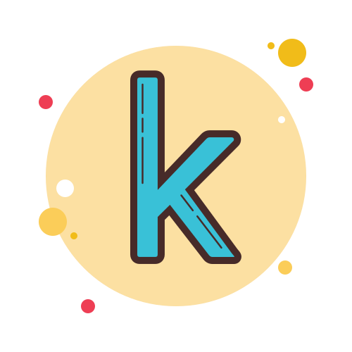

# Hello, World! 👋🏻 I'm Najd

  

 

A **Data Scientist** chasing the AI Rabbit 🐇, armed with a **B.Sc. in Management Information Systems** earned while hopping between rabbit holes.

I’m more of a model destroyer than a builder, like a kid smashing sandcastles, always chasing the thrill of building one that finally stands unshaken.

 

## Favourite Tools

### ML / DL

  
  
  
  
  
  
  
  
  
  
  
  
  
  
  
  
  
  
  
  
  
  
  
  

### Other

  
  
  
  
  
  
  

 

---

 

## While you’re here, why not let [John M. Coetzee](https://www.nobelprize.org/prizes/literature/2003/coetzee/facts/) take you to a *"peculiar headspace"*?

 

>  <em>“And for whom, anyway, do we do the things that lead to Nobel Prizes if not for our mothers?“</em>  
>  <strong>– J. M. Coetzee</strong>

 

https://github.com/user-attachments/assets/c20d97c2-e23b-485c-aa98-03beff2b9bcc

 

**J. M. Coetzee's speech at the Nobel Banquet, 10 December 2003.**  
*Sveriges Television AB (production)*  
Copyright © Sveriges Television AB 2003

 

#### If you’re wondering, this speech always leaves me caught up in a moment like:

 

